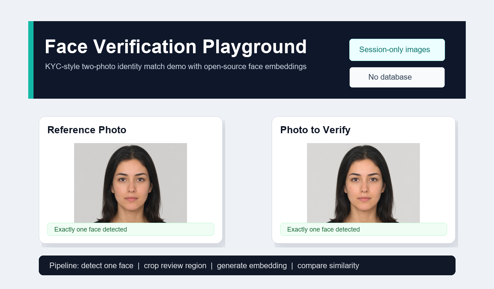

<div align="center">
  
  <h1>Face Verification Playground</h1>
  <p>
    A portfolio-grade KYC-style face verification application using an open-source face detection and embedding pipeline.
  </p>
  <p>
    <a href="https://face-verification-playground-y6njm5svnwtmynouybvhys.streamlit.app/"><strong>Live Streamlit Demo</strong></a>
    &nbsp;|&nbsp;
    <a href="#setup"><strong>Local Setup</strong></a>
    &nbsp;|&nbsp;
    <a href="#privacy"><strong>Privacy Notes</strong></a>
  </p>
</div>

---

## Application Overview

Face Verification Playground recreates the core workflow of a lightweight identity verification screen:

<table>
  <tr>
    <td width="33%"><strong>1. Capture</strong><br />Accept a reference photo and a verification photo from upload or live webcam capture.</td>
    <td width="33%"><strong>2. Validate</strong><br />Require exactly one detected face in each image before verification.</td>
    <td width="33%"><strong>3. Compare</strong><br />Compare face embeddings with normalized cosine similarity.</td>
  </tr>
</table>

This is a public, safe portfolio recreation. It contains no client code, no bank data, no proprietary weights, no authentication layer, and no persistent image storage.

The source code is public so technical reviewers can inspect the implementation. Only portfolio-safe demo code and synthetic sample images are included.

## Reference Images

The repository includes synthetic sample images so the app can be tested immediately without personal photos.

<table>
  <tr>
    <td align="center" width="50%">
      
      <br />
      <strong>Reference Photo</strong>
    </td>
    <td align="center" width="50%">
      
      <br />
      <strong>Photo to Verify</strong>
    </td>
  </tr>
</table>

## Product Behavior

- Each side supports both upload and live camera capture.
- A sample-photo mode is included for instant demos.
- The reference and verification images are validated independently.
- Zero-face images show a clear retry message.
- Multi-face images are rejected instead of auto-selecting a face.
- The Verify button stays disabled until both photos contain exactly one detected face.
- The result screen shows original photos, similarity score, Match or No Match verdict, and the face regions used for review.

## Implementation Notes

The application keeps the implementation intentionally small and backend-friendly:

- A detector component validates the face count and creates embeddings.
- A matcher component normalizes embeddings before cosine comparison.
- The default decision threshold is adjustable in the app.
- The app runs on CPU-friendly open-source dependencies and requires no paid API keys.

Exact dependency versions are kept in `requirements.txt` for reproducible setup, but the public product copy avoids exposing model-pack details.

## Setup

```bash
pip install -r requirements.txt
streamlit run app.py
```

Using `uv` with Python 3.12:

```bash
uv venv --python 3.12 .venv
uv pip install -r requirements.txt
uv run streamlit run app.py
```

The first run can take a few minutes while open-source pipeline assets are prepared.

On Windows with Python 3.12, some native packages may require Microsoft Visual C++ Build Tools when a matching wheel is unavailable.

## Tech Stack

<table>
  <tr><td><strong>Frontend</strong></td><td>Streamlit</td></tr>
  <tr><td><strong>Face pipeline</strong></td><td>Open-source face detection and embedding</td></tr>
  <tr><td><strong>Runtime</strong></td><td>Python 3.12</td></tr>
  <tr><td><strong>Inference backend</strong></td><td>CPU inference runtime</td></tr>
  <tr><td><strong>Image handling</strong></td><td>OpenCV headless, Pillow, NumPy</td></tr>
</table>

## Privacy

Photos are processed only in memory for the active Streamlit session. The app does not use a database, user accounts, cloud storage, or persistent file storage for uploaded or captured images.

## Limitations

This is an educational and portfolio demonstration, not a production identity-verification system. It does not include liveness checks, anti-spoofing, fraud review workflows, audit logging, or compliance controls.

## Project Structure

```text
face-verification-playground/
|-- app.py
|-- requirements.txt
|-- runtime.txt
|-- src/
|   |-- face_utils.py
|   `-- config.py
|-- sample_data/
|   |-- match_pair/
|   |   |-- ref.jpg
|   |   `-- verify.jpg
|   `-- no_match_pair/
|       |-- ref.jpg
|       `-- verify.jpg
|-- docs/
|   `-- assets/
|       |-- app-preview.png
|       |-- reference-sample.jpg
|       `-- verify-sample.jpg
|-- README.md
|-- LICENSE
|-- .gitignore
`-- .env.example
```

## License

MIT License. See [LICENSE](LICENSE).
